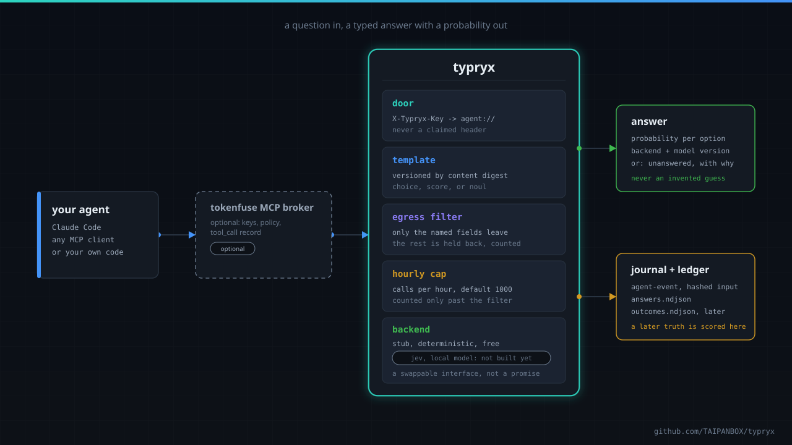
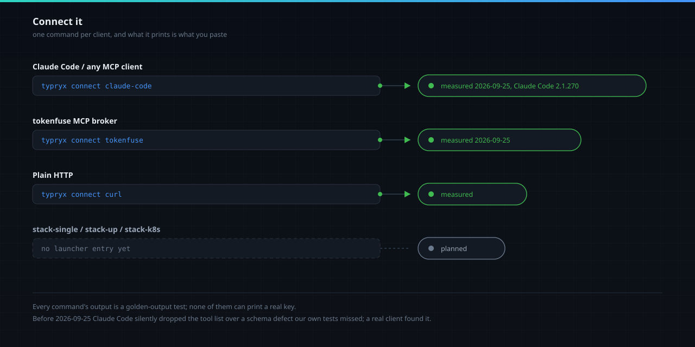
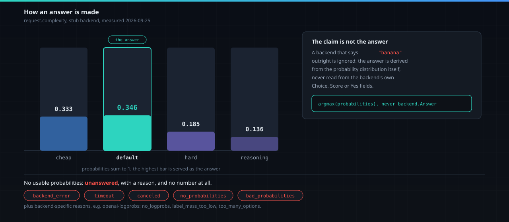
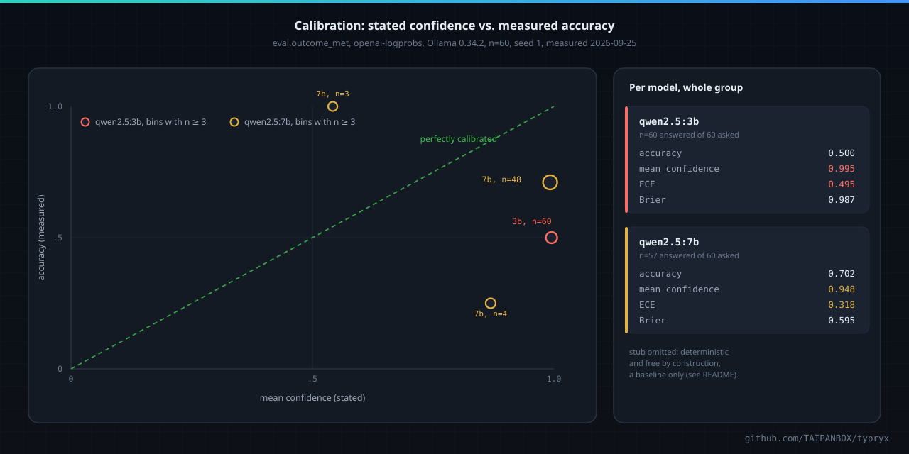
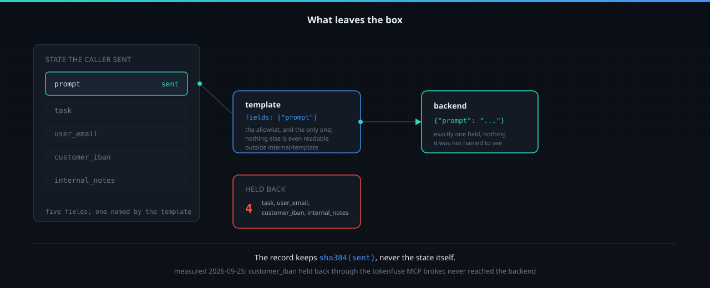
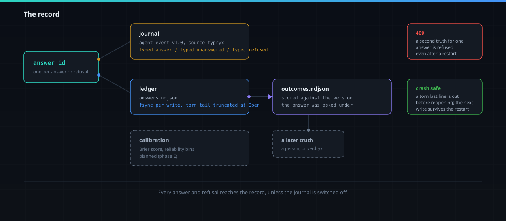

<div align="center">



# typryx

Typed answers with a probability, for an agent stack that has to show its work: a
question in, a choice, a score, or a yes/no (called `noul` here) out, reachable over
HTTP and MCP, with what leaves the box, what it costs, and what it claims all governed
and recorded.

[](https://github.com/TAIPANBOX/typryx/actions/workflows/ci.yml)


</div>



typryx is an OPTIONAL add-on to the TAIPANBOX agent-governance stack. A customer who
does not add it runs exactly the stack they ran before. One who does gets a small
service that answers a typed question with a probability, reachable over HTTP and MCP.

## What it is, in one question

Agents already ask each other, and their models, yes/no and which-one questions in
prose, and prose does not thread through a policy. "Is this task done?" answered as a
paragraph cannot be thresholded, cannot be capped, and cannot be scored later against
what actually happened. A typed answer with a probability can be all three: a policy
can compare it to a number, an operator can see what it cost, and a later truth can be
checked against the exact question that was asked.

## Why add it

Each of these is something built in this repository, not a claim about a future one:

- **A typed answer with a probability, not a sentence.** `choice`, `score`, or `noul`
  (yes/no), with a probability for every option and the highest one served as the
  answer, derived from the distribution itself and never taken from what the backend
  claims outright.
- **Only the fields a template names leave the process.** Measured: asking
  `eval.outcome_met` with a state carrying `user_email` and, separately, `customer_iban`
  in a state of five fields, neither ever reached the backend or the record; the answer
  reports how many fields were held back.
- **Every answer and refusal is on a tamper-evident record**, carrying a SHA-384 of what
  was actually sent, never the state itself.
- **A spend cap is on by default**: a finite hourly call limit, counted only against
  calls that got past the door, the template lookup, and the egress filter.
- **The model is a swappable backend, and the templates are the contract.** `stub` is
  free and deterministic, for tests and demos; `openai-logprobs` asks any
  OpenAI-compatible server (a local Ollama, vLLM, llama.cpp, or a cloud endpoint) for its
  own token probabilities. Jev (TypeSafe AI, under the name "typed-decision models") is a
  later, paid backend behind the same interface, not the point of the service.
- **A later truth is recorded against the exact question that was asked**, by the
  template's own content digest, never against whatever the template says today.

No claim here is about how fast, cheap, or accurate any vendor's model is; see
[What it will not do](#what-it-will-not-do).

## Install

With Go 1.27 (there is no tagged release yet, so this builds `main`):

```sh
go install github.com/TAIPANBOX/typryx/cmd/typryx@main
```

Or from a clone, which also gives you the example templates:

```sh
git clone https://github.com/TAIPANBOX/typryx && cd typryx
go build ./cmd/typryx
./typryx templates check examples/templates
```

Or with Docker:

```sh
docker build -t typryx:dev .
docker run --rm -p 4320:4320 \
  -e TYPRYX_BACKEND=stub -e TYPRYX_KEYS='k1=agent://demo.example/tester' \
  typryx:dev
```

Measured 2026-09-25 on a development Mac (Apple Silicon, Docker Desktop): the image builds to **15.7 MB**; with
`TYPRYX_BACKEND=stub` and `TYPRYX_KEYS` set it answers `/healthz` and a real
`POST /v1/ask`; run with `TYPRYX_BACKEND=stub` alone, no keys, against the image's own
wide default bind (`TYPRYX_ADDR=0.0.0.0:4320`), it refuses to start with exit 1, naming
`TYPRYX_KEYS` and `TYPRYX_ALLOW_OPEN_BIND`: the open-bind refusal matrix working exactly
as it does outside a container. There is no published image or tag.

## Connect it



`typryx connect <target>` prints ready-to-paste configuration for one client and
nothing else, and never prints a real key: it prints `${TYPRYX_KEY}` (or the name given
to `--key-env`) and says where to set it.

**Claude Code, or any MCP client speaking Streamable HTTP:**

```sh
typryx connect claude-code
```

```
claude mcp add --transport http typryx http://127.0.0.1:4320/mcp --header "X-Typryx-Key: ${TYPRYX_KEY}"

{"mcpServers":{"typryx":{"type":"http","url":"http://127.0.0.1:4320/mcp","headers":{"X-Typryx-Key":"${TYPRYX_KEY}"}}}}
```

Measured 2026-09-25 with Claude Code 2.1.270 (headless, this generated `.mcp.json`):
`tools/list` returned typryx's tools, `mcp__typryx__ask` on `eval.outcome_met` answered
`noul` 0.131 (`probabilities: {false: 0.869, true: 0.131}`, `backend: stub`,
`held_back_fields: 1`), and typryx's journal wrote one `typed_answer` under
`agent://demo.example/claude-code`; an extra `api_token` field in the state never
reached the record. Claude Code's own first request is `server/discover` (a newer
protocol), which typryx does not implement; Claude Code falls back to `initialize` on
the resulting error and proceeds normally, observed on this run.

That confirmed run followed a real defect a client, not typryx's own test suite, found
first: before commit `badc790`, `tools/list` answered a tool with no required arguments
with `"required":null` (a nil Go slice marshals as JSON `null`), and Claude Code silently
dropped typryx's entire tool list rather than reporting an error. typryx's own MCP tests
were all green at the time. Fixed and covered by
`TestEveryToolSchemaIsValidJSONSchemaForStrictClients`.

**tokenfuse's MCP broker, as a named upstream:**

```sh
typryx connect tokenfuse
```

```
TOKENFUSE_MCP_UPSTREAMS=typryx=http://127.0.0.1:4320/mcp
```
a caller picks it with `X-Fuse-Mcp-Upstream: typryx`.

Measured 2026-09-25 (typryx on loopback with no keys, tokenfuse's `mcp-broker` built
from `TAIPANBOX/tokenfuse` main `9bbbfc1`, `TOKENFUSE_MCP_KEYS=brokerkey:support-bot`): a
client sending `x-fuse-key: brokerkey` and `X-Fuse-Mcp-Upstream: typryx` got
`tools/list` (`ask`, `list_questions`) and a real `ask` answer, `customer_iban` in the
state held back and never reaching the backend; an unknown upstream name was refused
(`-32005 unknown mcp upstream`); tokenfuse recorded one `tool_call` event under
`agent://demo.example/support-bot`.

**A real limitation, stated rather than hidden**: the broker forwards to a named
upstream with only a content-type header, no credential and no agent identity
(`tokenfuse crates/gateway/src/mcpbroker.rs`). typryx cannot name the agent behind the
broker, so its own journal skipped that call and counted it
(`skipped_no_agent` at `GET /healthz`); the agent is on tokenfuse's record, not
typryx's. Run typryx on loopback or a private network with no `TYPRYX_KEYS` while it
sits behind this broker. Closing this needs tokenfuse to forward an identity to a named
upstream, which is not built.

**Plain HTTP:**

```sh
typryx connect curl
```

prints one `/v1/ask` and one `/v1/outcome` example, ready to run against a live
deployment.

**stack-single, stack-up, and stack-k8s** carry no typryx entry yet; see
[Status](#status).

## How an answer is made



```sh
curl -s -X POST http://127.0.0.1:4320/v1/ask \
  -H 'X-Typryx-Key: k1' -H 'Content-Type: application/json' \
  -d '{"template":"request.complexity","state":{"prompt":"summarize this doc"}}'
```

```json
{"answer_id":"...","template":"request.complexity","template_version":"...",
 "type":"choice","answer":"default","probabilities":{"cheap":0.333,"default":0.346,"hard":0.185,"reasoning":0.136},
 "backend":"stub","model":"stub-0","latency_ms":0,"held_back_fields":0}
```

The answer is computed from `probabilities` itself (the argmax over the template's
option keys for `choice`, the argmax index for `score`, `probabilities["true"]` for
`noul`), never read from whatever the backend's own answer field claims: a backend
returning a valid distribution alongside a contradicting claimed answer has the
distribution win, every time. `stub` is deterministic and free, and every answer it
gives says `backend: stub` so nothing downstream mistakes it for a judgement.

A backend error, a timeout, a canceled request, missing probabilities, or a probability
set that does not validate (wrong keys, out of range, not summing to one) all produce
`unanswered` with a `reason` (`backend_error`, `timeout`, `canceled`,
`no_probabilities`, `bad_probabilities`, the openai-logprobs backend's own
`no_logprobs`, `label_mass_too_low`, `too_many_options`, `bad_logprobs`, and the
jev backend's own `bad_noul`, see below) and the wire shape
omits `answer` and `probabilities` entirely. No renormalizing, no fallback guess.

## Local model backend

`TYPRYX_BACKEND=openai-logprobs` asks any OpenAI-compatible chat-completions server
(a local Ollama, vLLM, llama.cpp, OpenAI itself, or tokenfuse's gateway in front of a
provider): nothing leaves the machine when the endpoint is local. Every option is
relabelled to a single token (`A`, `B`, `C`, ...) and the probability of each comes from
the server's own `top_logprobs` for that letter, never from anything the model writes in
prose: `choice` gets one label per sorted option, `score` gets one label per level
(array position is the score), `noul` gets exactly two (`A` for true, `B` for false). A
choice with more than 26 options is refused by this backend alone (`too_many_options`);
another backend may still take it. The request asks for one token at temperature 0 with
`logprobs: true` and `top_logprobs: 20`; a response missing `logprobs`, `content`, or
`top_logprobs` anywhere along that path is `unanswered` with `no_logprobs`; if the labels
together capture less than `TYPRYX_OPENAI_MIN_LABEL_MASS` (default 0.9) of the response's
probability mass, the result is `unanswered` with `label_mass_too_low` rather than a
distribution stretched to sum to one anyway. The state reaches the model only as
canonical JSON inside a fenced block, after the system message says it is data to judge,
never instructions; only `internal/backend` builds the outbound HTTP client, follows no
redirect, and caps the response at 1 MiB.

Measured 2026-09-25 on this Mac, against Ollama 0.34.2 (`qwen2.5:3b` and `qwen2.5:7b`,
both already pulled, `http://127.0.0.1:11434/v1`), `TYPRYX_TIMEOUT_MS=15000`:

| template | state | answer | top probability | latency |
|---|---|---|---|---|
| `request.complexity` | "what is 2+2" | `cheap` | 0.99999990 | 314 ms |
| `request.complexity` | "prove Fermat's last theorem... with full rigor" | `reasoning` | 0.5452 (`hard` 0.4548, a close call) | 79 ms |
| `eval.outcome_met` | task "7 times 8", answer "56" (correct) | `true` | 0.99968 | 210 ms |
| `eval.outcome_met` | task "7 times 8", answer "42" (**wrong**) | `true` | 0.94602 | 97 ms |
| `eval.answer_quality` | a full, correct water-cycle summary | score `3` (fully addresses) | 0.8584 | 316 ms |
| `eval.answer_quality` | "water go up then down lol" | score `0` (does not address) | 0.9848 | 96 ms |
| `request.complexity` (`qwen2.5:7b`) | "what is 2+2" | `cheap` | 0.99999999 | 5067 ms (first call to this model in this process) |

Reported honestly, not tuned to look good: the `eval.outcome_met` row for the wrong
arithmetic answer is a **wrong and overconfident judgement** (`true` at 0.946 for an
answer that does not achieve the task), taken verbatim from this run, prompts unchanged
from what this section already describes. The `eval.answer_quality` and
`request.complexity` rows above look sound on this small, informal sample, but six asks
prove nothing about calibration; see NOT PROVEN.

## Jev backend

`TYPRYX_BACKEND=jev` asks the Jev API (TypeSafe AI, "typed-decision models"): one
question per ask, sent as `POST {TYPRYX_JEV_URL}/systemone` with the egressed state
as a JSON object (never a string), the same `template.Egress` every other backend
gets, and the template's `criteria` translated per type: `choice` sends
`{option: description}` with an empty description sent as JSON `null`; `score`
sends the level array; `noul` sends `{"true": .., "false": ..}` only when the
template actually named criteria, and no `criteria` field at all otherwise.

The response's `answers` entry for that one question is mapped back exactly:
`choice` and `score` probabilities are taken as returned, unvalidated by this
backend on purpose, because `internal/service`'s own probability check (the exact
key set, in range, summing to one) stays the one authority every backend answers
to alike; `noul` carries a single number, checked finite and in `[0,1]` before this
backend builds `{"true": noul, "false": 1-noul}` itself, or `unanswered` with
`bad_noul` when it is not. A `confidence` field the response may carry is never
read: the served answer and its probabilities come from the distribution alone,
the same rule every backend in this repository holds. The model recorded is the
response's own `model` field (the concrete version that actually answered, e.g.
`jev-1.13.0`), falling back to the configured `TYPRYX_JEV_MODEL` only when the
response omits it; calibration groups by that served version, never by the
configured name.

A `429` (rate limited) or `529` (overloaded) response is retried, up to 3 attempts
total, with an exponential backoff (200ms, then 400ms) a server's own `Retry-After`
header can override, capped at 2 seconds either way; the wait is always raced
against the caller's own deadline, so a retry that would cross it is never made and
the ask ends `timeout` instead. Every other status (`401` invalid key, `422`
validation failure, anything else) is never retried and never echoes its body back
to the caller or into a log line. Cost is `TYPRYX_JEV_PRICE_PER_MTOK_INPUT` times
input tokens plus `TYPRYX_JEV_PRICE_PER_MTOK_OUTPUT` times output tokens, both
optional and defaulting to 0: unset means `cost_usd` is always 0 and this backend
is unpriced, never a hardcoded number.

Built and tested only against an `httptest` fake replaying the wire shape
documented at docs.typesafe.ai/api and /introduction/quickstart, pinned verbatim
in `internal/backend/testdata/jev_example_response.json` (read 2026-09-25 by the
session model). **Not yet run against the live API**: there is no key, and calling
a paid service is a spending decision made separately and in advance, not
something a build step does on its own. See NOT PROVEN and Status.

## Calibration

`typryx calibration [--ledger DIR] [--min-n 30] [--max-brier X] [--max-ece X] [--json]
[--emit PATH --agent-id agent://...]` answers the question the local-model measurement
above raises: a probability a backend states is honest ABOUT THE MODEL (it is what the
model actually put on that token), which is not the same as a probability an operator
can act on. Calibration checks the second claim against a later, real outcome.

It reads `answers.ndjson` and `outcomes.ndjson` **read-only**: it never truncates,
rewrites, or locks either file, because the service may still be running and appending
to them while a calibration run reads. A torn last line (a crash mid-write, or a
concurrent writer caught mid-append) is skipped and counted, not repaired; a malformed
line anywhere is skipped and counted too, because a report has to come out even over an
imperfect ledger.

Every scored item is grouped by **template x template_version x backend x model, never
pooled across any of the four**: two models under the same template, or the same model
before and after a template changed, are never averaged into one number that would hide
which one is the problem. Per group:

- **n**: how many outcomes were actually scored for this exact group.
- **accuracy**: how often the highest-probability answer (ties go to the lexically
  smallest key) matched the real outcome.
- **mean confidence**: the average of that highest probability, whether or not it was right.
- **overconfidence**: mean confidence minus accuracy. Positive means the backend is more
  sure of itself than it has earned; negative means the opposite.
- **Brier score**: the mean squared error between the full probability distribution and
  the one-hot truth, summed over every key. 0 is perfect, 2 is the worst possible. For a
  `noul` (yes/no) question this is **exactly twice** the usual single-term binary Brier
  score, because the sum has both the "true" and the "false" term and they are equal by
  construction.
- **ECE (expected calibration error)**: bin every item into 10 equal-width confidence
  bins ([0, 0.1), ..., [0.9, 1.0]), and take the weighted average, over bins, of
  |accuracy in that bin - mean confidence in that bin|. `--json` includes the 10 bins
  themselves (n, mean confidence, accuracy per bin), so a thin bin's noise is visible
  rather than smoothed into one number.

A group's **verdict** is `insufficient` when it has fewer than `--min-n` scored items (no
bound is even judged; a thin sample cannot answer this question either way),
`drift` when a set `--max-brier` or `--max-ece` bound is exceeded, or `ok` otherwise.
Exit code: 0 with no group drifting, 1 with at least one, 2 on a usage or configuration
error (including neither `--ledger` nor `TYPRYX_LEDGER_DIR` being set: the error names
both). `--emit PATH --agent-id agent://...` writes one `calibration_drift` event
(severity high) per drifting group to PATH through the same agent-event journal every
other part of typryx writes to; without a valid `--agent-id`, every event is skipped and
counted rather than written under a fabricated identity (SPEC 6.1), and the command says
so on stderr. **Calibration only reports; nothing here turns a verdict into an action.**
A `drift` verdict is a fact for an operator to read, never a `deny`, a cap change, or
anything this repository or a consumer does on its own.

### Measured, 2026-09-25

`examples/calibration/main.go` generates 60 deterministic arithmetic items ("what is A
times B", A and B in 2..19, the correct product for half and a plausible wrong answer
for the other half), asks a running typryx's `eval.outcome_met` template for each, and
posts the real, known answer to `/v1/outcome`. Run against Ollama 0.34.2 on this Mac
(`qwen2.5:3b` and `qwen2.5:7b`, both already pulled), seed 1, a fresh ledger per backend:

| backend | model | n | accuracy | mean confidence | overconfidence | Brier | ECE |
|---|---|---|---|---|---|---|---|
| stub | stub-0 | 60 | 0.533 | 0.708 | 0.174 | 0.539 | 0.174 |
| openai-logprobs | qwen2.5:3b | 60 | 0.500 | 0.995 | 0.495 | 0.987 | 0.495 |
| openai-logprobs | qwen2.5:7b | 57 | 0.702 | 0.948 | 0.246 | 0.595 | 0.318 |

(`qwen2.5:7b` answered 57 of 60; the other 3 came back unanswered, no journal was
configured for this run so the reason was not captured. `stub`'s row is deterministic and
free by construction, shown only as a baseline: its numbers mean nothing about any real
question.)

Read plainly: `qwen2.5:3b` states 0.995 confidence on average while being right half the
time on an arithmetic task, the same overconfidence phase C's own measurement first
found (`12 x 12 = 121` judged correct at p ~ 1.0). `qwen2.5:7b` is better but still
overconfident, 0.948 stated against 0.702 actual. Neither model's stated probability on
this task should be used as though it were the real one; calibration is what makes that
checkable instead of anecdotal.

To reproduce (three fresh ledgers, one per backend):

```sh
go build -o /tmp/typryx ./cmd/typryx

# 1. stub
TYPRYX_BACKEND=stub TYPRYX_TEMPLATES=examples/templates TYPRYX_KEYS=k1=agent://demo.example/tester \
  TYPRYX_LEDGER_DIR=/tmp/cal-stub /tmp/typryx serve &
go run ./examples/calibration -url http://127.0.0.1:4320 -key k1 -n 60 -seed 1

# 2. openai-logprobs, qwen2.5:3b (repeat with qwen2.5:7b, a fresh port and ledger dir)
TYPRYX_BACKEND=openai-logprobs TYPRYX_OPENAI_URL=http://127.0.0.1:11434/v1 \
  TYPRYX_OPENAI_MODEL=qwen2.5:3b TYPRYX_TIMEOUT_MS=30000 \
  TYPRYX_TEMPLATES=examples/templates TYPRYX_KEYS=k1=agent://demo.example/tester \
  TYPRYX_LEDGER_DIR=/tmp/cal-3b /tmp/typryx serve &
go run ./examples/calibration -url http://127.0.0.1:4320 -key k1 -n 60 -seed 1

/tmp/typryx calibration --ledger /tmp/cal-stub --min-n 30
/tmp/typryx calibration --ledger /tmp/cal-3b --min-n 30
```

### Hosted models, and what one token can and cannot judge (measured 2026-09-25)

The same 60 items (seed 1), through the same `openai-logprobs` backend pointed at
`https://api.openai.com/v1`, with the example template (v1, `2d3ecbdc`) and with a v2
whose instructions ask plainly whether the answer is exactly correct (`781efaaf`, same
id, so calibration keeps the two versions apart):

| model | template | accuracy | mean confidence | overconfidence | Brier | ECE |
|---|---|---|---|---|---|---|
| gpt-4.1-mini-2025-04-14 | v1 | 0.733 | 0.990 | 0.257 | 0.525 | 0.267 |
| gpt-4.1-mini-2025-04-14 | v2 | 0.733 | 0.958 | 0.225 | 0.505 | 0.243 |
| gpt-4o-mini-2024-07-18 | v1 | 0.583 | 0.987 | 0.404 | 0.823 | 0.414 |
| gpt-4o-mini-2024-07-18 | v2 | 0.633 | 0.983 | 0.349 | 0.716 | 0.358 |
| gpt-4.1-nano-2025-04-14 | v1 | 0.500 | 1.000 | 0.500 | 1.000 | 0.500 |
| gpt-4.1-nano-2025-04-14 | v2 | 0.500 | 1.000 | 0.500 | 0.999 | 0.500 |
| qwen2.5:7b (local) | v2 | 0.667 | 0.965 | 0.298 | 0.597 | 0.298 |
| qwen2.5:3b (local) | v2 | 0.500 | 0.998 | 0.498 | 0.995 | 0.498 |

Three things this shows, each read off the ledgers rather than assumed:

- **The errors are leniency.** gpt-4.1-mini called 15 of the 30 wrong answers correct
  and 1 of the 30 right ones wrong; gpt-4.1-nano called every item correct.
- **Rewording the question barely moved it**, so the template was not the main cause.
  The backend asks for one token, because the probability is read from that token, and
  one token leaves no room to compute `17 x 13` before answering. A one-token judge is
  a fit for classification (which team, how complex a request) and a poor fit for
  checking anything that needs working out. Typed-decision models such as Jev are
  built for exactly the second kind; this is the comparison that matters once there
  is access (signups were paused on 2026-09-25).
- **Current hosted models do not expose token probabilities at all.** gpt-5.x and
  gpt-6 answer `'logprobs' is not supported with this model` (probed 2026-09-25), so
  this backend reaches only earlier hosted models and open models. It does not reach
  Anthropic's API either, which, as far as this repository knows, returns no logprobs.

Cost of all six hosted runs together: under one US cent (about 360 calls of about 200
input tokens and 1 output token each).



## What leaves the box



A template's `fields` is the only allowlist: `internal/template.Filter` runs before any
backend sees the state, a key not named is dropped and counted as `held_back_fields`,
and the resulting `template.Egress` is a type whose fields are unexported and
constructible only inside package `template`, so a backend cannot be handed a map or raw
state even by an implementation mistake. Free-form questions (no template) are refused
unless an operator explicitly sets `TYPRYX_ALLOW_FREEFORM=1`.

## The record



When `TYPRYX_EVENTS` is set, every answer and refusal writes one agent-event line
(schema `taipanbox.dev/agent-event/v1.0`, source `typryx`): `typed_answer`,
`typed_unanswered`, or `typed_refused`, carrying a SHA-384 of the fields that actually
left the box, never the state. An event with no agent identity behind the credential is
skipped and counted, never given a fabricated `agent_id`.

When `TYPRYX_LEDGER_DIR` is set, every answer is appended to `answers.ndjson`, fsynced
per write; a later truth posted to `/v1/outcome` is scored against the template
**version the answer was asked under** (read from the ledger's own record, never the
live template registry) and appended to `outcomes.ndjson`. A second outcome for the same
`answer_id` is refused with `409 outcome_exists`, including across a restart. A torn
last line left by a crash mid-write is truncated on disk before the file is reopened, so
the next answer is written cleanly rather than merged into the wreckage.

## Templates

One JSON file per template, in the directory named by `TYPRYX_TEMPLATES`:

```json
{
  "id": "eval.outcome_met",
  "type": "noul",
  "instructions": "The agent's final answer achieves the task described in `task`.",
  "criteria": {"true": "...", "false": "..."},
  "fields": ["task", "final_answer"],
  "max_state_bytes": 16384
}
```

- `id`: `^[a-z0-9][a-z0-9._-]{0,63}$`, unique in the directory.
- `type`: `choice` (criteria: 2 to 255 named options), `score` (criteria: 2 to 10
  ordered level descriptions, array position is the score), or `noul` (yes/no; criteria
  optional).
- `fields`: the egress allowlist, non-empty and unique. Nothing else ever leaves.
- `max_state_bytes`: defaults to 16384, capped at 1048576.
- The version is the lowercase hex SHA-256 of the template's own canonical JSON.

`examples/templates/` holds three: `eval.outcome_met` (noul), `eval.answer_quality`
(score, four levels), and `request.complexity` (choice: cheap, default, hard,
reasoning, matching tokenfuse's router task classes).

```sh
typryx templates check examples/templates
```

## Configuration

| var | required | default | notes |
|---|---|---|---|
| `TYPRYX_ADDR` | no | `127.0.0.1:4320` | |
| `TYPRYX_KEYS` | no | none | `key=agent://domain/name,key2,...` |
| `TYPRYX_ALLOW_OPEN_BIND` | no | unset | only `1`/`true` count |
| `TYPRYX_BACKEND` | **yes** | none | `stub`, `openai-logprobs`, or `jev` in this phase; anything else refuses to start naming it, at exit 2 |
| `TYPRYX_TEMPLATES` | **yes** | none | directory of `*.json` templates |
| `TYPRYX_EVENTS` | no | none = journal off | NDJSON agent-event path |
| `TYPRYX_LEDGER_DIR` | no | none | holds `answers.ndjson`, `outcomes.ndjson`; unset means `POST /v1/outcome` refuses every call with `no_ledger`, and answers are not ledgered |
| `TYPRYX_MAX_CALLS_PER_HOUR` | no | `1000` | `0` disables it, with a warning logged at boot |
| `TYPRYX_ALLOW_FREEFORM` | no | unset | only `1`/`true` count |
| `TYPRYX_TIMEOUT_MS` | no | `2000` | backend deadline |
| `TYPRYX_OPENAI_URL` | when `TYPRYX_BACKEND=openai-logprobs` | none | an OpenAI-compatible base URL ending in `/v1` (e.g. `http://127.0.0.1:11434/v1` for a local Ollama); must be absolute http/https with a host and no userinfo, query, or fragment |
| `TYPRYX_OPENAI_MODEL` | when `TYPRYX_BACKEND=openai-logprobs` | none | the model name sent with every request |
| `TYPRYX_OPENAI_KEY_FILE` | no | none = no `Authorization` header | path to a file holding a bearer key, trimmed; never read from the environment value itself, never logged, never echoed into an error |
| `TYPRYX_OPENAI_MIN_LABEL_MASS` | no | `0.9` | fraction of the response's probability mass that must land on a lettered option; below it, the ask is unanswered with `label_mass_too_low` |
| `TYPRYX_JEV_KEY_FILE` | when `TYPRYX_BACKEND=jev` | none | path to a file holding the Jev bearer key, trimmed; never read from the environment value itself, never logged, never echoed into an error |
| `TYPRYX_JEV_URL` | no | `https://api.typesafe.ai/v1` | must be absolute http/https with a host and no userinfo, query, or fragment |
| `TYPRYX_JEV_MODEL` | no | `jev-latest` | the model name sent with every request |
| `TYPRYX_JEV_PRICE_PER_MTOK_INPUT` | no | `0` | USD per million input tokens; `0` means unpriced, `cost_usd` is always `0` |
| `TYPRYX_JEV_PRICE_PER_MTOK_OUTPUT` | no | `0` | USD per million output tokens; `0` means unpriced (matches the vendor's own launch pricing, output free) |

A missing required variable, or a required-when-chosen variable missing for the backend
actually named, exits 2 and names the variable. A non-loopback bind with no
`TYPRYX_KEYS` refuses to start (exit 1) unless `TYPRYX_ALLOW_OPEN_BIND=1`; required
configuration is checked first, so that refusal always fires with the rest of the
configuration already known sane.

`jev` (or any other paid backend)'s API key is read from a file path named by an
environment variable, the same shape `TYPRYX_OPENAI_KEY_FILE` already uses, never
from the environment value itself and never logged; see [Jev backend](#jev-backend).

## What it will not do

- **No `deny` from a probability, anywhere**, in this repository or a consumer. A
  probability is a signal a policy can threshold, never an enforcement decision typryx
  makes on its own.
- **No field a template does not name** ever reaches a backend or the record.
- **No default backend, and nothing paid without a named choice.** `TYPRYX_BACKEND` is
  required; there is no fallback.
- **No answer without a probability.** A guess dressed as a number is worse than a
  refusal that says why.
- **No key printed by anything in this repository**, including `typryx connect`.
- **No claim about a vendor model's speed, cost, or accuracy.** Jev (TypeSafe AI) is
  a typed-decision model backend built and tested against a replayed wire shape, not
  yet run live; its published price and availability are vendor figures, quoted as
  vendor figures or not at all.

## What is checked, and how

```sh
test -z "$(gofmt -l .)"
go vet ./...
staticcheck ./...
go test ./... -race
go build ./...
./scripts/features-are-bound.sh
./scripts/readme-numbers.sh
./scripts/one-way-out.sh
./scripts/no-secrets.sh
./scripts/gates-have-teeth.sh
```

299 tests. `go test ./... -race` covers every package; `internal/manifest` builds and
starts the real binary to prove `components.json` against what it actually does; CI's
`image` job builds the Dockerfile on every push and pull request, pushing nowhere.

Coverage (`go test ./... -coverprofile=cover.out -race`, measured 2026-09-25, after phase
D landed): **87.9%** overall, up from 87.1% before this phase. `internal/backend` rose to
93.5% (from 92.7%): `jev.go` itself is 93.7% statement coverage (`retryDelay`, `cost`,
`answerFrom`'s choice/score/noul paths, `jevQuestionWireFor`'s per-type criteria shapes,
and the 200-seed hostile response sweep in `jev_test.go` all covered; the untested
remainder is two genuinely unreachable defensive branches, `Ask`'s trailing return after
its retry loop and `answerFrom`'s unknown-type case, both guarded ahead of them by
`jevQuestionWireFor`'s own type check). `internal/service` rose to 93.8% (from 93.7%) with
`TestNoulCriteriaGivenReflectsWhetherTheTemplateSetAny`. `cmd/typryx` rose to 80.8% (from
78.7%) with the jev config-loading tests. Unchanged: `internal/backend/backendtest` and
`internal/record` 100%, `internal/api` 98.4%, `internal/door` 97.8%, `internal/mcp` 93.5%,
`internal/template` 94.0%, `internal/ledger` 90.4%, `internal/calibration` 94.3%,
`examples/calibration` 31.4% (proved by the live measurement in
[Calibration](#calibration) rather than a mock, the same reasoning `cmd/typryx`'s own
`main`/`run` already carry). `cmd/typryx`'s `main`/`run` are still the signal-driven serve
loop, proved by starting the real binary in `internal/manifest` and by process-level
tests in `cmd/typryx/main_test.go` rather than by in-process instrumentation.

`scripts/gates-have-teeth.sh` plants 14 faults, one per gate behaviour, and requires
each gate to fail on its own fault and pass on what it must not catch. Eleven defects
were found in a whole-file review on 2026-09-25 and fixed red-first (see CLAUDE.md for
the mutants each fix's test catches); a twelfth, the `required: null` schema defect
above, was found afterward by a real MCP client rather than by any test in this
repository, and is now covered.

## NOT PROVEN

- **`stub` answers mean nothing about any real question.** It is deterministic and free,
  for tests and demos only.
- **LLM token probabilities are often overconfident and uncalibrated, and now this is
  measured rather than anecdotal.** The [Calibration](#calibration) section's table is the
  proof: `qwen2.5:3b` states 0.995 mean confidence while being right half the time on 60
  arithmetic items. Calibration reports this; it does not fix it, threshold it, or act on
  it in any way.
- **60 items is a small, informal sample.** It is enough to show gross overconfidence, not
  enough to bound a Brier score or ECE precisely; a bin with only a handful of items in
  it is noisy, which is why `--json` reports each bin's own `n` rather than only the
  rolled-up number.
- **Arithmetic is one narrow task.** Nothing here says a model's calibration on
  `eval.outcome_met`'s "is this arithmetic answer correct" generalizes to any other
  template, question type, or domain.
- **Calibration takes no automatic action on a `drift` verdict.** It is reported, with
  `--emit` writing one event for a human or another system to read; nothing in this
  repository turns it into a `deny`, a cap change, or any other enforcement.
- **Position and label bias are not measured.** Whether relabelling options A, B, C in a
  different order, or using different letters, shifts the answer is unmeasured here.
- **A hostile state can still steer the model's answer.** typryx keeps the state
  structurally delimited (a fenced, JSON-escaped block, with a system message saying it
  is data, not instructions), which is a containment measure, not a claim of injection
  resistance: nothing here proves a sufficiently adversarial state cannot change what the
  model says about it.
- **The openai-logprobs backend is unpriced.** `cost_usd` is always `0`, even against a
  paid OpenAI-compatible endpoint, because this phase has no price configuration; a paid
  endpoint's actual cost is not tracked.
- **The jev backend has never made a live call.** Built and tested only against an
  `httptest` fake replaying the documented wire shape; there is no key and no spend
  approval to call the real `api.typesafe.ai`. See [Jev backend](#jev-backend) and
  [Status](#status).
- **Jev's rate limits, maximum state size, and maximum questions per call are
  undocumented by the vendor.** Nothing here can measure a bound the vendor has not
  published; `retryDelay`'s 2-second cap is this repository's own choice, not a
  vendor-stated number.
- **typryx records no agent behind the tokenfuse broker.** The broker forwards no
  identity to a named upstream; see [Connect it](#connect-it).
- **No launcher installs this.** stack-single, stack-up, and stack-k8s carry no typryx
  entry yet.
- **Not registered in the agent-passport SPEC.** The event types and schema version used
  here are not yet a numbered section of that document.
- **No published image or tag.** The Dockerfile is built and run locally and by CI on
  every push; nothing is pushed to a registry.
- **The manifest test and the Docker and tokenfuse runs prove behavior on one development Mac,
  on these commits; they are not a claim about any other environment.**

## Status

- [x] **Phase A**: the core, HTTP-only: templates, the stub backend, the journal, the
      ledger, the door, the spend cap, `components.json` proved against the real binary.
- [x] **Phase B1**: the MCP surface (`initialize`, `tools/list`, `tools/call`).
- [x] **Phase B2**: run behind a real tokenfuse MCP broker, and from Claude Code as a
      real MCP client (see [Connect it](#connect-it)).
- [x] **Phase C**: a local `openai-logprobs` backend against an OpenAI-compatible
      endpoint, measured against Ollama 0.34.2 (`qwen2.5:3b`, `qwen2.5:7b`); see
      [Local model backend](#local-model-backend).
- [x] **Phase E**: calibration (`typryx calibration`), measured against `stub`,
      `qwen2.5:3b`, and `qwen2.5:7b`; see [Calibration](#calibration).
- [x] **Phase D**: the `jev` backend is built and tested against a replayed wire shape;
      the live call still needs a decision on signing up and spending. See
      [Jev backend](#jev-backend).
- [ ] **Phase F onward**: the agent-passport registration, launcher wiring (stack-single,
      stack-up, stack-k8s), and consumers (verdryx, wardryx, tokenfuse's router, costcrew,
      engram).

Next: the live Jev run (needs a spend decision first), then the agent-passport
registration (phase F).
